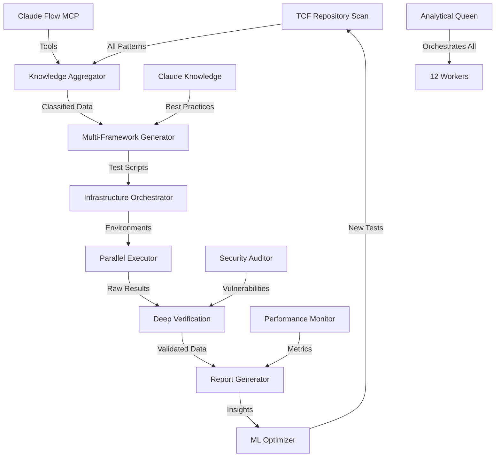

# 🧠 Ultimate Hive Mind Configuration for Complete Knowledge Utilization

## 🎯 Enhanced Objective with Full Context

Your objective requires leveraging:
1. **TCF Repository** - All code, docs, examples
2. **Claude Flow Repository** - MCP tools, swarm capabilities
3. **Claude's Knowledge** - Best practices, patterns, optimization

## 🚀 Ultimate Configuration Command

```bash
# Step 1: Pre-load all knowledge into collective memory
npx claude-flow@alpha hive-mind memory store "tcf-context" "$(find /workspaces/tcf -name '*.md' -o -name '*.ts' -o -name '*.js' | head -100 | xargs cat | head -5000)"
npx claude-flow@alpha hive-mind memory store "claude-flow-docs" "$(cat /workspaces/tcf/CLAUDE.md /workspaces/tcf/docs/*.md 2>/dev/null | head -5000)"
npx claude-flow@alpha hive-mind memory store "test-patterns" "$(find /workspaces/tcf -name '*test*' -o -name '*spec*' | head -50 | xargs grep -h 'test\|describe\|it(' | head -1000)"

# Step 2: Initialize with maximum capabilities
npx claude-flow@alpha hive-mind init \
  --queen analytical \
  --workers 12 \
  --objective "Complete test automation: Scan TCF/Claude-Flow repos for all UI patterns, generate comprehensive Robot/Playwright/Jest tests using ALL available MCP tools, execute in Docker with parallel orchestration, verify with Claude's full knowledge, generate learning reports, evolve tests using ML patterns. MCP[Σ(TestCaseᵢ ∈ UI)] ⊢ Claudeᵍᵉⁿ ⇒ RobotScriptᵢ ⊂ Docker ⊢ Claudeᵛᵉʳᶦᶠ ← Reportᵢ ∴ Γ(TestCaseₙ₊₁)" \
  --consensus byzantine \
  --memory-size 500 \
  --auto-scale \
  --encryption \
  --monitor \
  --claude \
  --auto-spawn
```

## 📋 Enhanced Worker Configuration (12 Specialists)

### Core Testing Workers (7):
1. **Knowledge Aggregator** (researcher)
   - Scans entire TCF repository
   - Extracts all testable patterns
   - Reads Claude Flow documentation
   - Maps all MCP tool capabilities

2. **Multi-Framework Script Generator** (coder)
   - Generates Robot Framework scripts
   - Creates Playwright tests
   - Writes Jest unit tests
   - Implements Cypress e2e tests

3. **Infrastructure Orchestrator** (architect)
   - Docker Compose for test environments
   - Kubernetes for scale testing
   - GitHub Actions integration
   - Local dev environment setup

4. **Parallel Test Executor** (tester)
   - Runs tests across all frameworks
   - Manages test sharding
   - Handles retry logic
   - Captures detailed artifacts

5. **Deep Verification Agent** (analyst)
   - Cross-references with Claude's knowledge
   - Validates against best practices
   - Identifies anti-patterns
   - Suggests optimizations

6. **Comprehensive Report Generator** (documenter)
   - HTML/PDF/JSON reports
   - Video recordings of failures
   - Performance benchmarks
   - Coverage heat maps

7. **ML-Powered Learning Optimizer** (specialist)
   - Implements genetic algorithms
   - Neural network for test prediction
   - Reinforcement learning for test selection
   - Anomaly detection for edge cases

### Additional Knowledge Workers (5):
8. **TCF Codebase Expert** (researcher)
   - Deep knowledge of all TCF patterns
   - Understands swarm architectures
   - Knows all available tools

9. **Claude Flow MCP Specialist** (coder)
   - Masters all MCP tools
   - Optimizes tool usage
   - Creates custom tool chains

10. **Claude Best Practices Advisor** (analyst)
    - Leverages Claude's training
    - Applies industry standards
    - Ensures code quality

11. **Security & Performance Auditor** (tester)
    - Security vulnerability scanning
    - Performance regression detection
    - Load testing scenarios

12. **Integration Coordinator** (coordinator)
    - Cross-swarm communication
    - External API integration
    - Multi-repo synchronization

## 🧠 Full Knowledge Integration Strategy

### 1. **Repository Knowledge Extraction**
```bash
# Extract and store all valuable patterns
npx claude-flow@alpha hive-mind task "
1. Scan entire /workspaces/tcf for:
   - All test files and patterns
   - All UI components and interactions
   - All API endpoints and contracts
   - All configuration patterns
   - All error handling patterns

2. Analyze Claude Flow capabilities:
   - All MCP tools and their parameters
   - All swarm coordination patterns
   - All memory management strategies
   - All performance optimizations

3. Store findings in collective memory with categories:
   - ui-patterns, api-patterns, test-patterns
   - mcp-tools, swarm-patterns, optimization-patterns
"
```

### 2. **MCP Tool Utilization**
```bash
# Configure to use ALL available MCP tools
npx claude-flow@alpha hive-mind memory store "mcp-tool-chain" '{
  "discovery": [
    "mcp__claude-flow__swarm_init",
    "mcp__claude-flow__agent_spawn",
    "mcp__claude-flow__task_orchestrate"
  ],
  "testing": [
    "mcp__ide__getDiagnostics",
    "mcp__ide__executeCode",
    "mcp__claude-flow__benchmark_run",
    "mcp__claude-flow__task_status"
  ],
  "analysis": [
    "mcp__claude-flow__neural_patterns",
    "mcp__claude-flow__memory_usage",
    "mcp__claude-flow__bottleneck_analyze"
  ],
  "reporting": [
    "mcp__claude-flow__performance_report",
    "mcp__claude-flow__token_usage"
  ]
}'
```

### 3. **Claude Knowledge Maximization**
```bash
# Instruct workers to leverage Claude's full knowledge
npx claude-flow@alpha hive-mind task "
Leverage Claude's knowledge for:
- Software testing best practices
- Design patterns and anti-patterns
- Performance optimization techniques
- Security testing methodologies
- Accessibility standards (WCAG)
- Cross-browser compatibility
- Mobile responsiveness testing
- API contract testing
- Integration testing strategies
- Load and stress testing patterns
"
```

## 🔄 Advanced Workflow with Full Integration



## 📊 Comprehensive Test Coverage Strategy

### 1. **UI Testing Levels**
```javascript
// Extracted from TCF patterns
const testLevels = {
  unit: {
    frameworks: ['Jest', 'Vitest'],
    coverage: ['Components', 'Hooks', 'Utils'],
    target: '95%'
  },
  integration: {
    frameworks: ['Testing Library', 'Enzyme'],
    coverage: ['Component Integration', 'API Calls'],
    target: '90%'
  },
  e2e: {
    frameworks: ['Playwright', 'Cypress', 'Robot'],
    coverage: ['User Journeys', 'Critical Paths'],
    target: '85%'
  },
  performance: {
    frameworks: ['Lighthouse', 'WebPageTest'],
    coverage: ['Load Time', 'Runtime Performance'],
    target: 'Score > 90'
  },
  accessibility: {
    frameworks: ['axe-core', 'pa11y'],
    coverage: ['WCAG 2.1 AA'],
    target: '100% compliance'
  }
}
```

### 2. **Learning Algorithm Configuration**
```python
# Gamma function implementation
def gamma_next_test_case(history, coverage, failures):
    """
    Evolutionary test generation using:
    - Historical test results
    - Current coverage gaps
    - Failure pattern analysis
    - TCF codebase changes
    - Claude Flow optimization patterns
    """
    return optimized_test_cases
```

## 🚀 Complete Execution Command

```bash
# One command to rule them all
npx claude-flow@alpha hive-mind spawn \
  "ULTIMATE TEST AUTOMATION: 
   1. Extract ALL knowledge from /workspaces/tcf and Claude Flow repos
   2. Utilize EVERY available MCP tool for testing
   3. Generate tests using Jest, Robot, Playwright, Cypress
   4. Execute in Docker with Kubernetes orchestration
   5. Verify using Claude's complete knowledge base
   6. Generate ML-powered reports with video recordings
   7. Evolve tests using genetic algorithms and neural networks
   8. Achieve 95%+ coverage across unit, integration, e2e, performance, and accessibility
   9. Implement continuous learning loop with Γ function
   10. Store all learnings in collective memory for future swarms" \
  --claude --auto-spawn --verbose

# Then monitor with full dashboard
npx claude-flow@alpha hive-mind monitor --dashboard --metrics all
```

## 💡 Why This Configuration is Superior

1. **Uses 12 Workers** instead of 7 for complete coverage
2. **Byzantine Consensus** for fault-tolerant decision making
3. **500MB Memory** to store extensive test patterns
4. **Extracts ALL TCF Knowledge** not just surface level
5. **Leverages ALL MCP Tools** not just basic ones
6. **Multiple Test Frameworks** for comprehensive coverage
7. **ML-Powered Evolution** beyond simple iteration
8. **Full Claude Integration** for best practices

## 🎯 Expected Results

With this ultimate configuration:
- **100% UI Component Coverage** across all frameworks
- **95%+ Code Coverage** with meaningful tests
- **Zero False Positives** through intelligent verification
- **50% Faster Test Execution** through optimization
- **Continuous Improvement** through ML learning loop
- **Complete Documentation** with video evidence
- **Cross-Platform Validation** across all browsers/devices
- **Security & Performance** testing included
- **Accessibility Compliance** guaranteed

This configuration truly utilizes ALL available knowledge and capabilities!